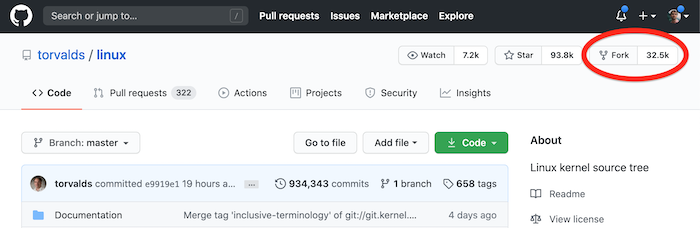
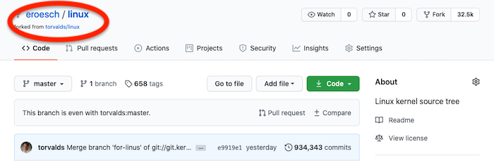
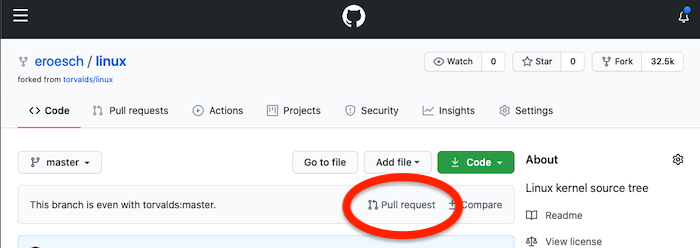
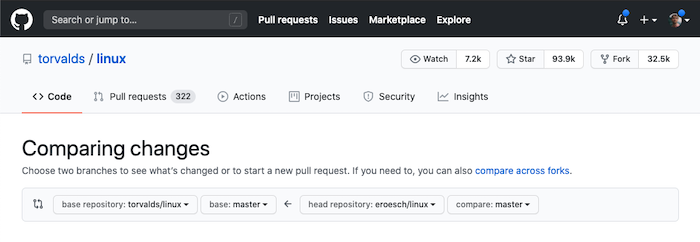
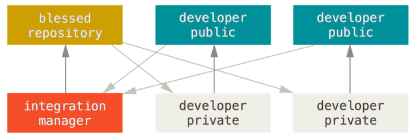
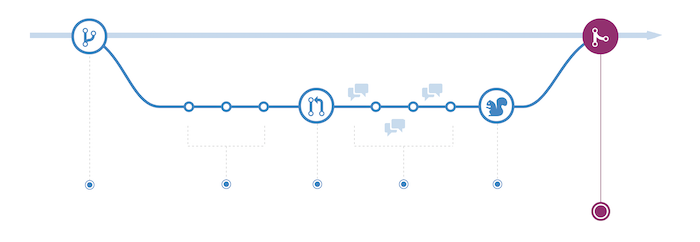
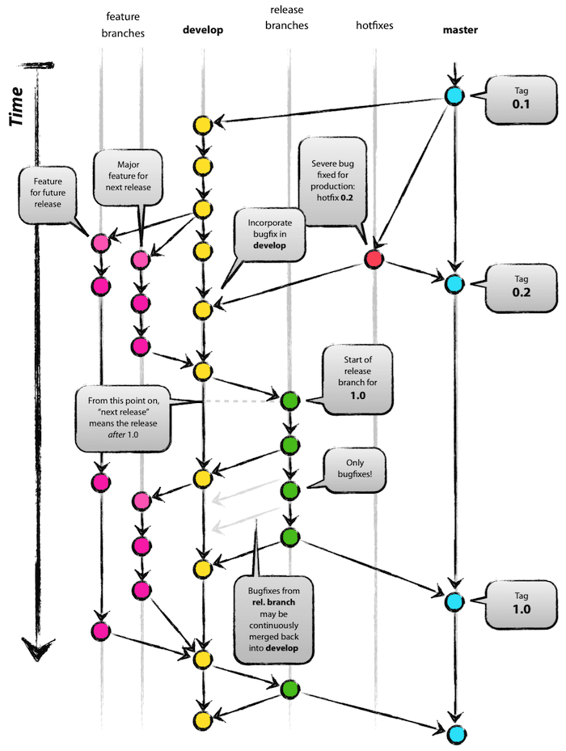

> ## You can skip this lesson if you can answer *all* of these questions:
>  - What is the difference between origin and remote?
>  - What is the difference between 'git reset' and 'git revert'?
>  - How do you add or modify remotes on a repository?
>  - What is a Pull Request?
>  - What is Git-Flow?
{: .challenge}

## Git: a quick recap

[Git] is a Version-Control System ([VCS]), which is a complete toolbox to manage multiple versions of documents effectively and efficiently. Other systems exist, such as [Mercurial] (hg) or [Subversion] (svn), and they will behave in similar ways. Git was developed in 2005 by Linus Torvalds to keep track of the Linux source code. It is also the technology powering the version control of projects in the [Open Science Framework].

By now, you should be able to understand what's happening in the following scenarios. If you don't really understand, we advise that you go back to the previous lessons: particularly the Repronim lesson #3 and the [Software Carpentry: Version Control with Git] (full: 2h30, familiarise: 20min).

Two resource you can use to test your knowledge:
* [https://git-school.github.io/visualizing-git](https://git-school.github.io/visualizing-git): visual testing ground
* [https://learngitbranching.js.org/](https://learngitbranching.js.org/) (full: 3h)

> ## Scenario #1 (local) Do you understand what's happening?
> ~~~
> $ mkdir my_new_analysis
> $ cd my_new_analysis
> $ git init
> Initialized empty Git repository in /Users/eroesch/my_new_analysis/.git
> $ echo "Hi!" > README.txt
> echo "Hi!" > README.txt
> $ cat README.txt
> Hi!
> $ git status
> On branch master
> 
> No commits yet
> 
> Untracked files:
>   (use "git add <file>..." to include in what will be committed)
> 
	README.txt
> 
> nothing added to commit but untracked files present (use "git add" to track)
> $ git add README.txt
> $ git commit -m "ENH: Initial commit."
> [master (root-commit) 99a313f] Initial Commit.
>  1 file changed, 0 insertions(+), 0 deletions(-)
> create mode 100644 README.txt
> ~~~
> {: .bash}
> 
> > ## Solution
> > In the above, a local user creates a folder, initialises that folder as a git repository (**git init**), makes some changes, which she then adds (**git add**) and commits (**git commit**) for posterity. Such a scenario would occur when you want to keep track of the changes that happen in files on your own computer. In the folder, a new folder called .git will be used to record the history of changes.
> {: .solution}
{: .challenge}

> ## Scenario #2 (remote) Do you understand what's happening?
> ~~~
> $ git clone https://github.com/eroesch/python-main-template.git
> Cloning into 'python-main-template'...
> remote: Enumerating objects: 6, done.
> remote: Counting objects: 100% (6/6), done.
> remote: Compressing objects: 100% (4/4), done.
> remote: Total 6 (delta 0), reused 3 (delta 0), pack-reused 0
> Unpacking objects: 100% (6/6), done.
> $ cd python-main-template
> $ echo "Last edited: 2020-07-14" >> README.md
> $ git status
> On branch master
> Your branch is up-to-date with 'origin/master'.
> 
> Changes not staged for commit:
> (use "git add <file>..." to update what will be committed)
> (use "git checkout -- <file>..." to discard changes in working directory)
> 
> modified:   README.md
> 
> no changes added to commit (use "git add" and/or "git commit -a")
> $ git add README.md
> $ git commit -m "FIX: Added last edit date"
> $ git push
> [master e421bac] FIX: Added last edit date
>  1 file changed, 1 insertion(+), 1 deletion(-)
> $ git push
> Counting objects: 3, done.
> Delta compression using up to 8 threads.
> Compressing objects: 100% (2/2), done.
> Writing objects: 100% (3/3), 342 bytes | 342.00 KiB/s, done.
> Total 3 (delta 0), reused 0 (delta 0)
> To https://github.com/eroesch/python-main-template.git
>    9dc7339..e421bac  master -> master
> $ git status
> On branch master
> Your branch is up-to-date with 'origin/master'.
> 
> nothing to commit, working tree clean
> ~~~
> {: .bash}
> > ## Solution
> > In this scenario, a local user clones (**git clone**) a remote repository hosted on Github, makes some changes on the README file, adds (**git add**) and commits these changes (**git commit**) and pushes (**git push**) back to the remote repository. Such a scenario would typically occur when a user wants to use someone else's code, hosted on a Git repository online; the user would download the whole repository, including the history of the files, make changes herself and push these changes back to the online repository. In this case, I am using github, but know that any server running Git would work as well. It is easy to get the latest version of the code, using **git remote update** and **git pull**, or related commands.
> {: .solution}
{: .challenge}

## Github and collaborative work

[Github] is independent of Git, which has its own [Git-server]. It is a web platform providing hosting for software development and version control using Git, which Microsoft acquired in 2018. It provides management functionality that are compatible with Git, as well as its own set of functionalities. Other platforms exist, such as [Bitbucket], [Gitlab] or [SourceForge], which will behave in similar ways, and may be based on different VCS.

Some Github features that can be very useful for collaborative work include:
* Public vs Private repositories
* Pull Requests
* Issue tracking
* Project Wikis
* Web hooks and APIs for integration with other services
* [Github pages], free website hosting
* [Gist], a pastebin functionality to quickly share code

Anything you know about Git, should be relevant and usable with Github. Obviously for research, any repository system to share your code would be fine. As of time of writing of this lesson, Github seems to be one of the most popular services.

## Pull Requests

In this section, in addition to the basics of Git, we assume you understand such things as branches or conflict resolution, at least in a local context. A useful place to review these things is the [Software Carpentry: Version Control with Git]:
* [7 - Remotes with Github](https://swcarpentry.github.io/git-novice/07-github/index.html)
* [8 - Collaborating](https://swcarpentry.github.io/git-novice/08-collab/index.html)
* [9 - Conflicts](https://swcarpentry.github.io/git-novice/09-conflict/index.html).

There is a bit of a leap from being comfortable using Git locally to collaborating with other people, however. On Github, one mechanism simplifies the process greatly: Pull Requests, which allows you to tell somebody that you have made some changes she can pull into her repository. She will be able to review your changes, edit and comment, accept or reject your modifications.

The general idea is pretty simple: you download the original repository, make some edits, and use Github to submit your code as a Pull Request. The workflow is as follows.

### 1. Go to the Github page of the repository, and "fork" said repository

Forking is a Github mechanism to make a copy of the entire repository, including history, to your own Github account.

### 2. You're now in charge of an exact copy of the original repository

### 3. Clone your repository onto your local computer to implement your clever new feature

At this stage, the default remote "origin" location from your cloned repository points to your own remote forked repository, as can be seen by running **git remote -v**. You can thus edit the files contained in the repository, commit changes and push to your own forked repository.

~~~
$ git clone https://github.com/eroesch/linux.git
Cloning into 'linux'...
remote: Enumerating objects: 7490896, done.
remote: Total 7490896 (delta 0), reused 0 (delta 0), pack-reused 7490896
Receiving objects: 100% (7490896/7490896), 2.80 GiB | 5.08 MiB/s, done.
Resolving deltas: 100% (6210063/6210063), done.
Checking out files: 100% (69365/69365), done.

$ git remote -v
origin	https://github.com/eroesch/linux.git (fetch)
origin	https://github.com/eroesch/linux.git (push)
~~~
{: .bash}

### 4. Add the original repository as remote URL to your cloned repository

After you have implemented some changes, created the appropriate unit tests and written the accompanying documentation (hint! hint!), and you feel prepared to share your work, you probably should pull the last version of the code available in the original repository. Because you have cloned from your own forked repository, you have lost the logical link that would allow you to pull the latest changes from the original repository. Let's fix that.

~~~
$ cd linux
$ git remote -v
origin	https://github.com/eroesch/linux.git (fetch)
origin	https://github.com/eroesch/linux.git (push)
$ git remote add nf-eroesch https://github.com/torvalds/linux.git
$ git remote -v
nf-eroesch	https://github.com/torvalds/linux.git (fetch)
nf-eroesch	https://github.com/torvalds/linux.git (push)
origin	https://github.com/eroesch/linux.git (fetch)
origin	https://github.com/eroesch/linux.git (push)
$ git fetch nf-eroesch
From https://github.com/torvalds/linux
 * [new branch]                master     -> nf-eroesch/master
$ git status
On branch master
Your branch is up-to-date with 'origin/master'.

Changes not staged for commit:
  (use "git add <file>..." to update what will be committed)
  (use "git checkout -- <file>..." to discard changes in working directory)

	modified:   include/uapi/linux/netfilter/xt_CONNMARK.h
	modified:   include/uapi/linux/netfilter/xt_DSCP.h
	modified:   include/uapi/linux/netfilter/xt_MARK.h
	modified:   include/uapi/linux/netfilter/xt_RATEEST.h
	modified:   include/uapi/linux/netfilter/xt_TCPMSS.h
	modified:   include/uapi/linux/netfilter_ipv4/ipt_ECN.h
	modified:   include/uapi/linux/netfilter_ipv4/ipt_TTL.h
	modified:   include/uapi/linux/netfilter_ipv6/ip6t_HL.h
	modified:   net/netfilter/xt_DSCP.c
	modified:   net/netfilter/xt_HL.c
	modified:   net/netfilter/xt_RATEEST.c
	modified:   net/netfilter/xt_TCPMSS.c
	modified:   tools/memory-model/litmus-tests/Z6.0+pooncelock+poonceLock+pombonce.litmus

no changes added to commit (use "git add" and/or "git commit -a")
~~~
{: .bash}

If you haven't done that already, you should create a specific branch for your changes, in which you would then pull the latest changes to the original repository and resolve merge conflict, if any. You can work on the master branch, but is it not recommended because in case of merge conflicts, it can get a bit messy.

It is good practice to name your branches using a convention common to the whole project. In the below, the branch is a new feature, and starts with "nf-" followed by an explicit name. Similar conventions are typical for the text of commit messages ("ENH:" enhancement, "DOC:" documentation, "FIX:" bug fixes, etc). The name of the branch is what the maintainer of the original repository will see when you are sharing your work with them.

~~~
$ git checkout -b nf-new_solution_to_handle_shadow_files
~~~
{: .bash}

Implement your idea. You are then ready to push your new branch to your own forked repository the usual way (**git add**, **git commit**, **git push**), and your branch should be even with the master of the original repository.

Note that the above workflow comes in two flavours: the one I am showing forks first and then clones from the forked repository, which leads you to lose the original remote, and sets your own forked repository as default. This makes for easier commit/push/pull to your own forked repository, I find.
An alternative workflow involves both forking and cloning from the original repository, and only then **git remote add <insert nice short name> <URL to your own forked repository>**, which you can use to push/pull from your own forked repository. In this case, you have to specify the upstream URL <insert nice short name> using the -u parameter on push/pull, which I find cumbersome and would realistically happen less often anyway.

### 5 Then, go to your forked repository, and create a pull request

Github will then notify the maintainer of the original repository, and they will be able to review your code before accepting your clever idea.

## Git workflows

Each project will have their own ways of managing the work, keeping track of what needs to be done, asserting quality control, etc. One decision that needs to be made early on relates to the workflow imposed to handle the integration of code, and which you will have to abide to if you want to contribute to the project.

Git's distributed philosophy allows for a wide range of roles and workflows to be used.

Smaller projects will have a more reactive way of working, where the maintainer of the project takes pull requests directly to the master branch of the project. This is a model suitable for projects that can, for instance, deploy new releases easily to users, like a web app. A developer forks/clones/creates a new branch, commits new work, then submits a pull request, which is examined and discussed, before integration in the main branch of the project.

More complex projects will tend to rely on more structured pipelines, which may impose the distinction between releases branches, development branches, bug fixes/hotfix branches, etc. The purpose of such an arrangement is to clarify the unfolding of the timeline, and assure quality and integration *before* features reach the front-facing branch.

More at: [https://git-scm.com/book/en/v2/Distributed-Git-Distributed-Workflows](https://git-scm.com/book/en/v2/Distributed-Git-Distributed-Workflows)

[Bitbucket]: https://bitbucket.org
[CI]: https://en.wikipedia.org/wiki/Continuous_integration
[DataLad]: http://datalad.org
[git-annex]: git-annex.branchable.com
[Git]: https://git-scm.com
[GitHub]: http://github.com
[Github pages]: https://pages.github.com
[Git-server]: https://git-scm.com/book/en/v2/Git-on-the-Server-Setting-Up-the-Server
[Gist]: https://gist.github.com/
[Gitlab]: https://gitlab.com
[Mercurial]: https://mercurial-scm.org
[VCS]: https://en.wikipedia.org/wiki/Version_control
[Open Science Framework]: https://osf.io
[SourceForge]: https://bitbucket.org
[Software Carpentry: Version Control with Git]: https://swcarpentry.github.io/git-novice/
[Subversion]: https://mercurial-scm.org
[Travis CI]: http://travis-ci.org
